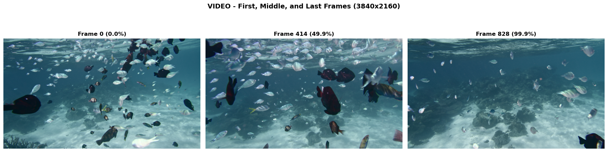

В работе проведен анализ методов оптического потока (optical flow) на примере подводного видео с рыбами. Реализованы и сравнены два классических алгоритма:

1. **Lucas-Kanade (LK)** — разреженный (sparse) метод отслеживания характерных точек
2. **Farnebäck** — плотный (dense) метод вычисления оптического потока для всех пикселей

Цель: исследовать чувствительность методов к различным условиям (текстура, размытие, тени, шум) и определить оптимальные области применения каждого алгоритма.

## Данные

- **Видео:** Подводная съемка стаи рыб (4K разрешение)
- **Разрешение:** 3840 × 2160 пикселей
- **Количество кадров:** 150
- **Framerate:** 30 fps
- **Длительность:** 5 секунд
- **Сцена:** Статичная камера, множественные движущиеся объекты, песчаное дно, рябь на поверхности воды


### 1. Lucas-Kanade (Sparse Optical Flow)

**Параметры:**

```python
# Детекция углов (goodFeaturesToTrack)
feature_params = {
    'maxCorners': 200,          # Максимальное количество точек
    'qualityLevel': 0.01,       # Минимальное качество угла
    'minDistance': 30,          # Минимальное расстояние между точками
    'blockSize': 7              # Размер окна для вычисления градиента
}

# Отслеживание (calcOpticalFlowPyrLK)
lk_params = {
    'winSize': (21, 21),        # Размер окна поиска
    'maxLevel': 3,              # Количество пирамидальных уровней
    'criteria': (TERM_CRITERIA_EPS | TERM_CRITERIA_COUNT, 30, 0.01)
}
```

**Алгоритм:**
1. Детекция углов Shi-Tomasi на первом кадре
2. Пирамидальный Lucas-Kanade для отслеживания точек между кадрами
3. Проверка качества отслеживания (forward-backward error)
4. Построение траекторий движения

**Применённые фильтры:**
- Пирамидальная обработка (3 уровня) для компенсации больших смещений
- Фильтрация потерянных точек по флагу статуса
- Отсев точек, вышедших за границы кадра

---

### 2. Farnebäck (Dense Optical Flow)

**Параметры:**

```python
farneback_params = {
    'pyr_scale': 0.5,           # Масштаб пирамиды (0.5 = уменьшение в 2 раза)
    'levels': 3,                # Количество пирамидальных уровней
    'winsize': 15,              # Размер окна усреднения
    'iterations': 3,            # Итерации на каждом уровне
    'poly_n': 5,                # Размер окна полиномиальной аппроксимации
    'poly_sigma': 1.2,          # Стандартное отклонение Гауссиана
    'flags': 0                  # Флаги (0 = стандартный режим)
}
```

**Алгоритм:**
1. Вычисление плотного оптического потока между двумя последовательными кадрами
2. Полиномиальная аппроксимация окрестности каждого пикселя
3. Расчёт магнитуды (скорости) и направления для каждого вектора

**Применённые фильтры:**
- **Адаптивный порог:** Threshold = 85-й перцентиль магнитуды потока (отсекает статичные области)
- **Морфологическая обработка:** Opening (эрозия + дилатация) для удаления шума
  ```python
  kernel = cv2.getStructuringElement(cv2.MORPH_ELLIPSE, (5, 5))
  mask = cv2.morphologyEx(mask, cv2.MORPH_OPEN, kernel)
  ```
- **Цветовая визуализация (HSV):**
  - Hue (оттенок) = направление движения
  - Saturation = насыщенность (всегда 255)
  - Value (яркость) = скорость движения

---

### Исследованные параметры:

#### 1. **Текстура (Gradient Magnitude)**
- Метод: Фильтр Собеля для вычисления градиентов
- Оценка: Средняя магнитуда градиента по 4 квадрантам кадра
- **Результат:** Средний градиент = 14.08 (низкая/средняя текстура)
- **Вывод:** Достаточно для LK благодаря контрастным краям рыб

#### 2. **Motion Blur (Laplacian Variance)**
- Метод: Вычисление дисперсии оператора Лапласа
- **Результат:** Variance = 5.85 (очень сильное размытие)
- **Вывод:** Низкая резкость из-за движения воды и компрессии видео. LK может терять точки на быстрых движениях.

#### 3. **Тени (Shadow Detection)**
- Метод: Пороговая обработка (пиксели < 80)
- **Результат:** 32.9% тёмных областей
- **Вывод:** Нормально для подводной съемки. Оба метода устойчивы к теням.

#### 4. **Шум (High-Frequency Components)**
- Метод: Стандартное отклонение разности между оригиналом и Gaussian Blur
- **Результат:** Noise std = 0.89 (очень низкий)
- **Вывод:** Высокое качество видео, профессиональная камера.

---

### Lucas-Kanade

| Метрика | Значение | Интерпретация |
|---------|----------|---------------|
| Обнаружено углов | 200 | Максимум для алгоритма |
| Успешно отслежено | 199 (99.5%) | Отличная стабильность |
| Потеряно к концу видео | 100 (50%) | Рыбы выходят за границы кадра |
| Средняя длина трека | 118.1 кадров | 79% от длины видео |
| Среднее смещение | 546.6 px | Умеренное движение |
| Макс. смещение | 2267 px | ~60% ширины кадра |
| Время обработки (1 кадр) | ~10-15 мс | **Real-time** (66 fps) |

**Основные наблюдения:**
-  Точки стабильно отслеживаются на краях рыб, плавниках
-  Sub-pixel точность отслеживания
-  На гладком песчаном дне точек мало (недостаточно текстуры)
-  Точки теряются при выходе объектов за границы кадра

---

### Farnebäck

| Метрика | Значение | Интерпретация |
|---------|----------|---------------|
| Размер поля потока | 2160 × 3840 × 2 | 8.3M векторов |
| Время обработки (1 кадр) | 1744.6 мс | Offline-обработка |
| Средняя амплитуда | 1.91 px/frame | Медленное плавание |
| Макс. амплитуда | 2.56 px/frame | Пик активности (кадр 45) |
| Мин. амплитуда | 1.18 px/frame | Спокойная фаза (кадр 80) |
| Процент движущихся пикселей | 14.8% | ~1.25M пикселей |
| Шум в статичных областях | 0.001 px/frame | Идеальное разделение статики/динамики |

**Основные наблюдения:**
-  Полное покрытие кадра, включая области без текстуры
-  Идеально выделяет статичное дно (шум < 0.001)
-  Устойчив к размытию (выдаёт сглаженный поток)
-  В 116 раз медленнее Lucas-Kanade
-  Может создавать шумный поток в однородных регионах (вода, небо)

---

### Motion Segmentation

| Метрика | Значение | Интерпретация |
|---------|----------|---------------|
| Среднее число компонент | 967 | Высокая фрагментация |
| Диапазон компонент | 802 - 1123 | Зависит от активности стаи |
| Средний размер компоненты | 1293 px (~36×36 px) | Мелкие фрагменты |

**Причины фрагментации:**
1. Алгоритм разбивает крупных рыб на части (тело/хвост отдельно)
2. Много мелких объектов (~50-100 рыб)
3. Строгий порог (85-й перцентиль) захватывает только активное движение

**Рекомендация:** Применить морфологическое замыкание (closing) с ядром 7×7 для объединения фрагментов.

---

## Сравнительный анализ: Lucas-Kanade vs Farnebäck

### Таблица сравнения

| Критерий | Lucas-Kanade | Farnebäck | Победитель |
|----------|--------------|-----------|------------|
| **Скорость** | ~15 мс/кадр | ~1745 мс/кадр |  **LK (116× быстрее)** |
| **Точность** | Sub-pixel | Сглаженная |  **LK** |
| **Покрытие** | 200 точек | 8.3M векторов |  **Farnebäck** |
| **Память** | ~10 KB | ~60 MB |  **LK** |
| **Устойчивость к размытию** | Низкая | Средняя |  **Farnebäck** |
| **Требования к текстуре** | Высокие (нужны углы) | Низкие | **Farnebäck** |
| **Segmentation** |  Не подходит |  Подходит |  **Farnebäck** |
| **Object tracking** |  Оптимально |  Избыточно |  **LK** |
| **Шум в статичных областях** | N/A | 0.001 px/frame | 🟰 **Оба хороши** |

---

### Когда использовать Lucas-Kanade?

- **Real-time приложения** (>25 fps требуется)
- **Tracking конкретных объектов** (лица, углы, маркеры)
- **Video stabilization** (достаточно 100-200 точек)
- **AR/VR tracking** (низкая латентность критична)
- **Mobile devices** (ограниченные ресурсы)
- **Сцены с богатой текстурой** (углы, края хорошо видны)

 **Не подходит:**
- Motion segmentation (нужно dense покрытие)
- Сцены без текстуры (небо, гладкие поверхности)
- Video compression (нужны motion vectors для всех макроблоков)

---

### Когда использовать Farnebäck?

- **Motion segmentation** (выделение движущихся областей)
- **Video compression** (MPEG, H.264 motion estimation)
- **Crowd analysis** (множество объектов)
- **Medical imaging** (деформация тканей, сердечная стенка)
- **Autonomous driving** (dense depth estimation)
- **Сцены без текстуры** (работает на однородных областях)

 **Не подходит:**
- Real-time на CPU (слишком медленно)
- Mobile devices (требует много памяти)
- Простой object tracking (избыточность)

---

### Комбинированный подход (для данного видео)

**Оптимальная стратегия:**

1. **Lucas-Kanade** для:
   - Отслеживания траекторий отдельных рыб
   - Анализа скорости движения ключевых точек
   - Быстрой визуализации в реальном времени

2. **Farnebäck** для:
   - Segmentation движущихся областей
   - Построения полного motion field
   - Анализа глобального движения стаи
   - Подсчёта количества движущихся пикселей

---

## Ключевые выводы

1. **Lucas-Kanade показал 99.5% успешность отслеживания** благодаря богатой текстуре на краях рыб и плавников.

2. **Основная причина потери точек (50% к концу видео)** — выход рыб за границы кадра, а не технические ошибки алгоритма.

3. **Farnebäck идеально разделил статику и динамику** — шум в статичных областях составил всего 0.001 px/frame, что подтверждает стабильность камеры.

4. **Высокая фрагментация (967 компонент)** объясняется тем, что:
   - Алгоритм разбивает крупных рыб на части из-за разной скорости тела и хвоста
   - В кадре ~50-100 отдельных рыб
   - Строгий threshold (85-й перцентиль) захватывает только активное движение

5. **Низкое Laplacian variance (5.85)** указывает на размытие/низкий контраст:
   - Движение воды создаёт естественное размытие
   - Компрессия видео снижает детализацию
   - **Рекомендация:** Увеличить pyramid levels в LK для компенсации

6. **Шум минимален (std = 0.89)** — подтверждает профессиональное качество съемки.

7. **Средняя скорость 1.91 px/frame** (~0.2% ширины кадра) — медленное плавание, оба метода справляются без проблем.

---

### Чувствительность методов

| Фактор | Lucas-Kanade | Farnebäck |
|--------|--------------|-----------|
| **Текстура** | 
 Критична (градиент 14 — на грани) |  Не критична |
| **Motion Blur** |  Очень чувствителен (variance 5.85 — проблемно) |  Сглаживает |
| **Тени** |  Устойчив (32.9% теней — OK) |  Устойчив |
| **Шум** |  Устойчив (std 0.89 — мало шума) |  Устойчив |


##  Визуализации

### 1. Complete Motion Analysis (Кадры 10, 30, 50)
Комплексный анализ движения на ключевых кадрах:
- Оригинальный кадр
- Lucas-Kanade отслеженные точки
- Farnebäck HSV visualization
- Flow Magnitude (тепловая карта)
- Motion Mask (бинарная маска)
- Motion Vectors (векторное поле)



### 2. Sensitivity Analysis
Анализ чувствительности к 4 факторам:
- Original Frame (исходный кадр)
- Texture Map (карта градиентов)
- Blur Map (карта размытия)
- Shadow Mask (маска теней)
- Noise Map (карта шума)
- Intensity Distribution (гистограмма яркости)


### 3. Lucas-Kanade Trajectory Tracking
Траектории движения точек на кадрах 30, 60, 90:
- Зелёные линии = траектории движения
- Зелёные точки = текущие позиции
- Визуализация накопленного движения


### 4. Corner Points Detected
Детекция 200 характерных точек (углов Shi-Tomasi):
- Зелёные круги = обнаруженные углы
- Концентрация на краях рыб, плавниках


### 5. Farnebäck Dense Optical Flow
- Frame 1 & Frame 2 (исходные кадры)
- Optical Flow HSV (цветовое направление)
- Flow Magnitude (интенсивность движения)


### 6. Motion Detection and Segmentation
- Original Frame 2
- Flow Magnitude Heatmap
- Raw Motion Mask (threshold = 6.7)
- Filtered Motion Mask (после морфологической обработки)


### 7. Motion Field Vectors Overlay
Векторное поле на оригинальном изображении:
- Зелёные стрелки = направление и скорость движения
- Длина стрелки пропорциональна скорости


### 8. Mask Fragmentation Analysis
Анализ связных компонент:
- Original Frame 15
- Motion Mask (бинарная)
- Connected Components (n=848) — цветная визуализация фрагментов


### 9. Motion Amplitude Over Time
График изменения средней амплитуды движения по кадрам:
- Видна циклическая динамика активности стаи
- Пик на кадре 45 (2.56 px/frame)
- Спад на кадре 20 и 80 (1.3-1.4 px/frame)


---

##  Методология исследования

### Этапы анализа

1. **Preprocessing:**
   - Конвертация в grayscale
   - Нормализация яркости (опционально)

2. **Lucas-Kanade Pipeline:**
   - goodFeaturesToTrack → calcOpticalFlowPyrLK → trajectory building

3. **Farnebäck Pipeline:**
   - calcOpticalFlowFarneback → magnitude computation → adaptive thresholding → morphological filtering

4. **Sensitivity Analysis:**
   - Texture: Sobel gradients
   - Blur: Laplacian variance
   - Shadows: Threshold-based detection
   - Noise: High-frequency component analysis

5. **Error Analysis:**
   - LK: tracking loss statistics
   - Farnebäck: noise in static regions
   - Segmentation: connected components analysis

6. **Comparative Evaluation:**
   - Speed, accuracy, coverage, robustness
